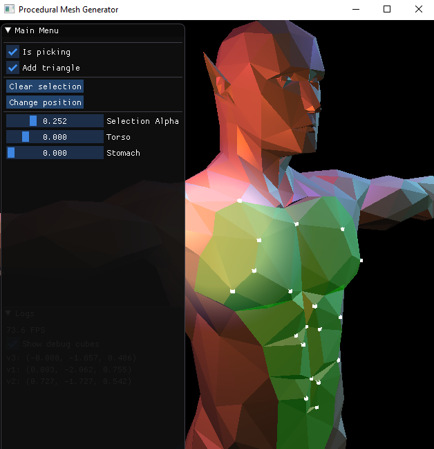

# ProceduralMeshGenerator

A WIP tool which will help a 3d artist to quickly generate different variations of a base humanoid model.

Big game projects requires large number of humanoid models, and it takes a lot to make every single model. This tool is being
developed to reduce that extra workload and a wide variety of different models can be generated by a single model only.

